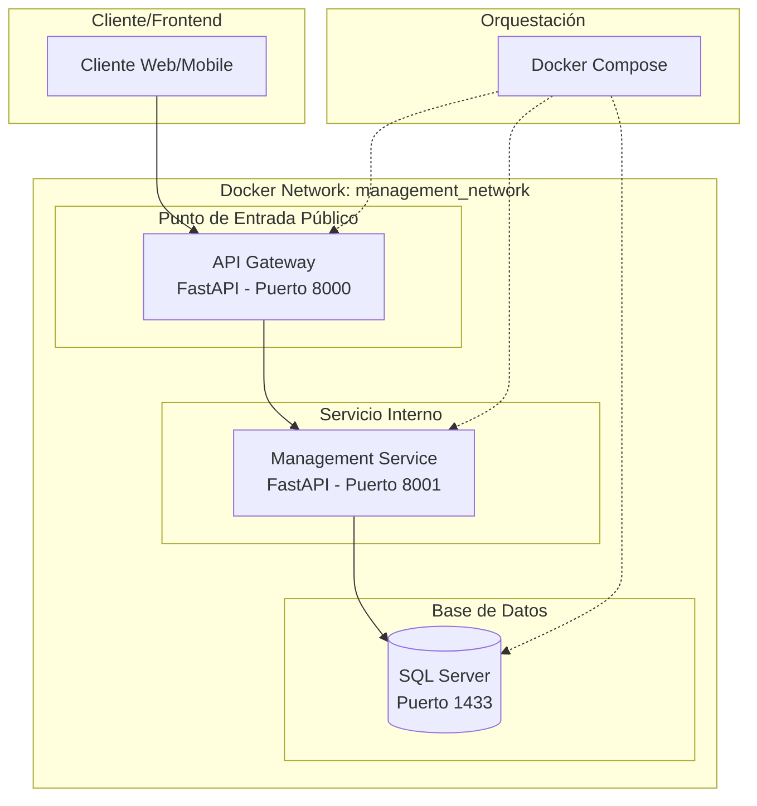

# 🏭 Management API - CIESA
Sistema de gestión de base de datos para planta de producción, implementado con una arquitectura desacoplada que utiliza un API Gateway y un servicio de gestión monolítico con principios de arquitectura hexagonal.

## 📋 Índice
🏗️ Arquitectura  

🚀 Inicio Rápido  

🛠️ Desarrollo  

🐳 Docker  

📚 API  

🔧 Configuración Avanzada  

📞 Soporte  

---

## 🏗️ Arquitectura
El proyecto utiliza un API Gateway como punto de entrada único que se comunica con un servicio de gestión (management_service) interno. Este servicio, a su vez, implementa arquitectura hexagonal (ports & adapters) para mantener una clara separación de la lógica de negocio.

### 🔧 Servicios Desplegados
| Servicio            | Puerto Público | Puerto Interno | Responsabilidad                                        | Estado       |
|---------------------|----------------|----------------|------------------------------------------------------|--------------|
| api_gateway         | 8000           | 8000           | Punto de entrada único, enruta peticiones al servicio de gestión. | ✅ Productivo |
| management_service  | N/A            | 8001           | Contiene toda la lógica de negocio (empleados, producción, etc). | ✅ Productivo |

### 📊 Diagrama de Arquitectura


---

## 🚀 Inicio Rápido
### 📋 Prerrequisitos
- Python 3.12+  
- Docker y Docker Compose  
- Git  

### ⚡ Instalación
Clonar el repositorio:  
```bash
git clone <url-repositorio>
cd management-api
```

Configurar variables de entorno:  
Crea un archivo `.env` a partir de `.env.example` y ajústalo con la configuración de tu base de datos externa.

Levantar los servicios con Docker:  
```bash
docker-compose up -d --build
```

---

## 🛠️ Desarrollo
### Endpoint Health Check
Para verificar que el punto de entrada público está funcionando:
```bash
curl http://localhost:8000/health
```

---

## 🐳 Docker
### Comandos Principales
```bash
# Levantar servicios en segundo plano
docker-compose up -d

# Ver logs de un servicio (gateway o management_service)
docker-compose logs -f api_gateway

# Detener y eliminar contenedores
docker-compose down
```

---

## 📚 API
Una vez que los contenedores estén en ejecución, la documentación interactiva de la API estará disponible a través del API Gateway:

- **Swagger UI**: [http://localhost:8000/docs](http://localhost:8000/docs)  
- **ReDoc**: [http://localhost:8000/redoc](http://localhost:8000/redoc)  

---

## 📞 Soporte
### Problemas Comunes
- **Error de conexión a SQL Server**: Verifica las variables en tu archivo `.env`.  
- **Puerto 8000 ocupado**: Asegúrate de que ningún otro proceso esté usando el puerto del gateway.  

---

🏭 Desarrollado para CIESA - Sistema de administración de base de datos de Producción  
API Gateway · Servicio Monolítico · Arquitectura Hexagonal · Python · FastAPI · SQL Server · Docker  
